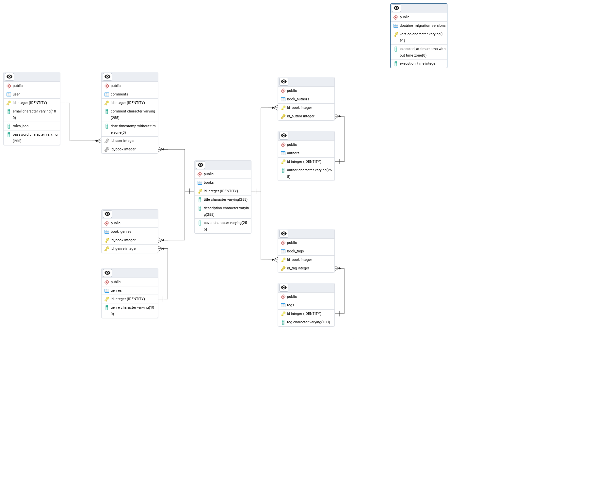

# Power of Knowledge
## Table of Contents
- [Overview](#overview)
- [Setup Instructions](#setup-instructions)
- [Technologies Used](#technologies-used)
- [Architecture](#architecture)
    - [Architecture Diagram](#architecture-diagram)
    - [ERD Diagram](#erd-diagram)

## Overview

**Power of Knowledge** is a web-based application designed to display, organize, and manage books. It provides a user-friendly, responsive interface where users can browse books, search by titles/authors, and filter by genres and tags.

## Setup Instructions
### Prerequisites
- [Docker](https://www.docker.com/) installed on your system
- A working internet connection to access Docker images and dependencies

### Steps to Run
1. Clone the repository or download the project files:
``` bash
   git clone <this_repository_s_URL>
```
2. Navigate to the project folder and run:
``` bash
   docker compose up --build
```
3. Install backend dependencies, by running:
``` bash
   docker compose run --rm -it php composer install
```
1. Access the application:
   - **Website:** Open [http://localhost:5173](http://localhost:5173) in your browser.
   - **Database Admin Panel:** Open [http://localhost:5050](http://localhost:5050).
     - You can also access the database using other programs such as Navicat.
2. Log in to the database admin panel using credentials found in the `.env` file (ensure you secure this file if deploying publicly).
3. Customize `.env` variables for production-grade deployment.

## Technologies Used
- **Frontend:**
   - React + JavaScript + Vite
   - HTML5, CSS3

- **Backend:**
   - Symfony(PHP)
   - RabbitMQ

- **Database:**
   - PostgreSQL
   - pgAdmin (for graphical free interface while using database)

- **Additional Tools:**
   - Docker for containerization and easy environment setup
   - Git for version control

## Architecture
This application can be split into 3 main parts: frontend, backend and database.

### Architecture Diagram

```
+-------------------+       +-------------------+       +-------------------+
|                   |       |                   |       |                   |
|   Browser/User    | <---> |     Frontend      | <---> |     Backend       |
|                   |       |   (React + Vite)  |       |   (Symfony PHP)   |
+-------------------+       +-------------------+       +-------------------+
                                                           |         ↑
                                                           |         |
                                                    +-------------+  |
                                                    |  RabbitMQ   |  |
                                                    +-------------+  |
                                                           |         |
                                                    +-------------+  |
                                                    | PostgreSQL  |<-+
                                                    +-------------+
                                                           |
                                                    +-------------+
                                                    |   pgAdmin   |
                                                    +-------------+
```
### Frontend
Frontend is based on React (Vite).
It handles user interface and user experience.
Used because it is a modern library for building user interfaces.
Vite enables fast development and hot-reload,
while React allows for creating dynamic, responsive single-page applications (SPA).
### Backend
On the backend it runs PHP Symfony.
It handles the API that communicates with frontend and the database (in database's case it uses Doctrine).
I used it because it is a stable and feature-rich framework for building APIs and web applications.
It provides high security, supports Doctrine ORM, and offers easy integration with JWT and RabbitMQ.

Where RabbitMQ is a message broker for handling asynchronous tasks (e.g. event logging).
### Database
PostgreSQL - a relational database that is efficient and scalable, well-supported by Symfony/Doctrine.
And for easy use pgAdmin which is a graphical tool for managing PostgreSQL databases.
### ERD Diagram
